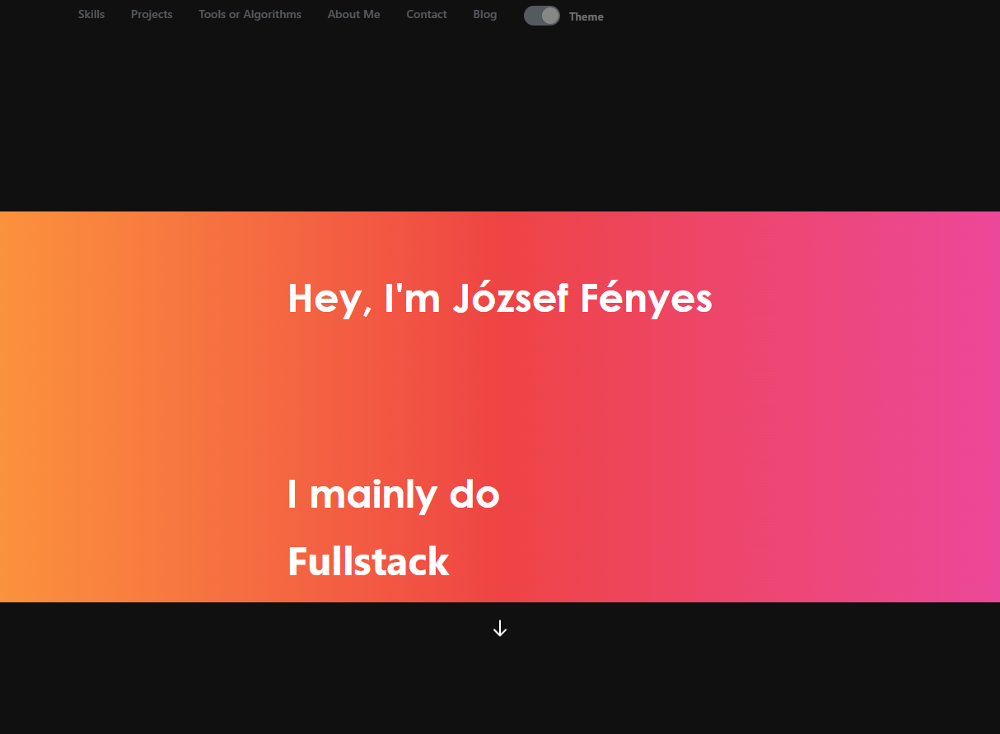

# My Personal Portfolio
NextJS Portfolio for personal use, this simple portfolio website is built with nextjs and tailwind css. This is static website uses gray-matter for converting markdown to html for the blog.

## Libraries

  - NextJS
  - ReactJS
  - Tailwind CSS
  - grey-matter
  - markdown
  - SEO Friendly
  - react-icons
  - react-text-transition

## Getting Started
  Node.JS is required before compiling on your local machine.
  
## Installing
 - Clone the project using git cli
    - `git clone https://github.com/pingvin12/pingvin12.github.io.git`
  * Update or download necessary packages
    - `npm i`
  * Run dev build using nextjs
    - `next dev`
    

